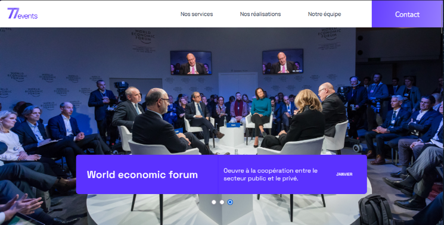

# 724 Events

## Contexte
Vous êtes développeur front-end freelance, et l’agence évènementielle 724events vous contacte pour une mission. 
L’agence souhaite publier la nouvelle version de son site vitrine. 
Le design a été validé, et un premier développeur freelance a commencé l’intégration il y a quelques semaines. 
Le site est fonctionnel, mais quelques bugs entravent le bon usage par les visiteurs. 724events fait donc appel à vous pour finaliser le travail.

## Mission
Débuggez le site d'une agence d'événementiel

## Étapes du projet
- Mettre en place l'environnement de développement
- Installez React Developer Tools
- Réparez les bugs
- Rédigez le cahier de recette
